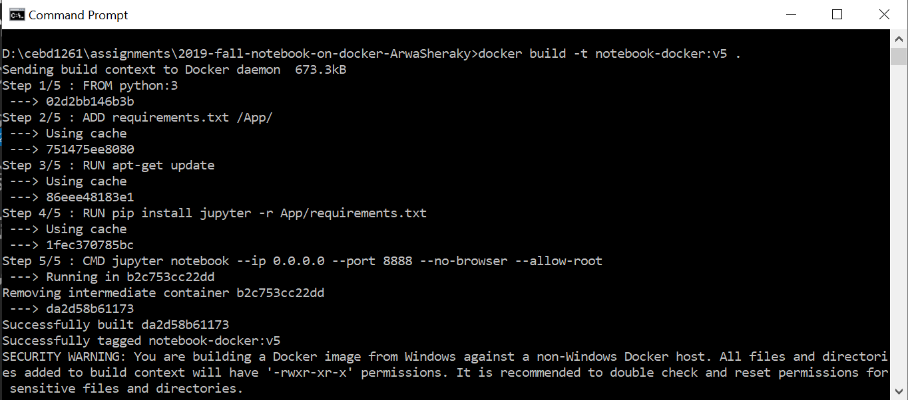
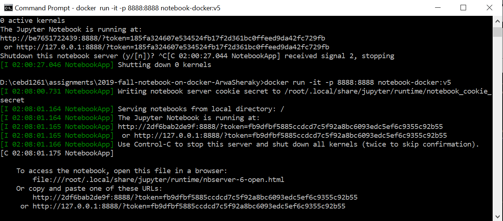
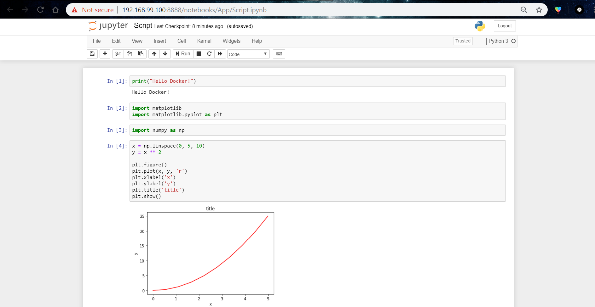

## How to use jupyter notebook on Docker?
* Download this Repository
* Activate Docker
* Build the image: `docker build -it image-name:version .`
* Run the image: `docker run -it -p 8888:8888 image-name:version`
* Open the browser: `https://locallhost.com:8888/?token=token-id`
* OR if you're using docker toolbox: `192.168.99.100:8888/?token=token-id`, 192.168.99.100 is __docker-machine default ip__

________________________

## Screenshots:

* Build:

* Run:

* Access:

* Notebook in action:
Following this [simple tutorial](https://nbviewer.jupyter.org/github/jrjohansson/scientific-python-lectures/blob/master/Lecture-4-Matplotlib.ipynb).

## On Docker Hub:
https://cloud.docker.com/repository/docker/arwasheraky/docker-notebook
